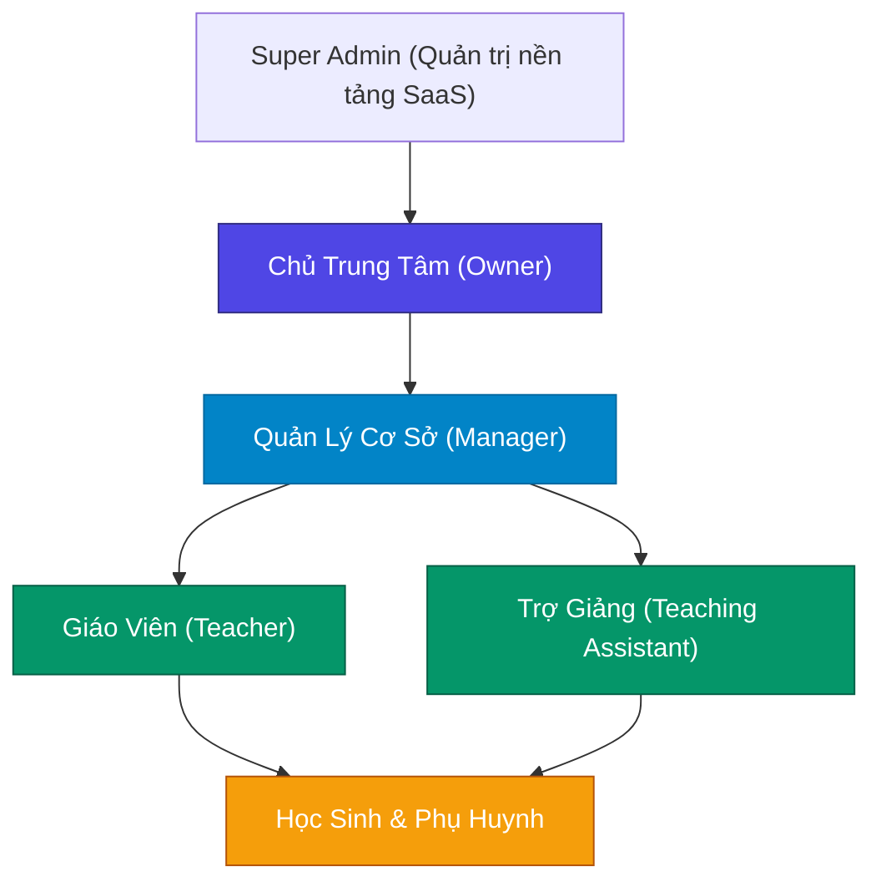
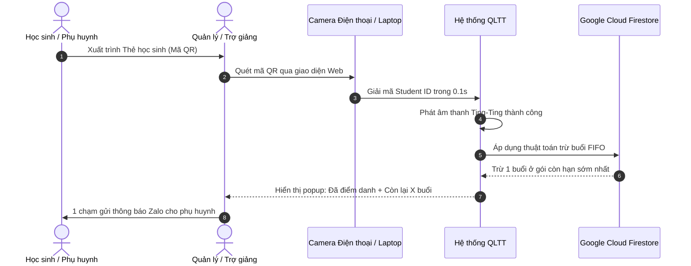
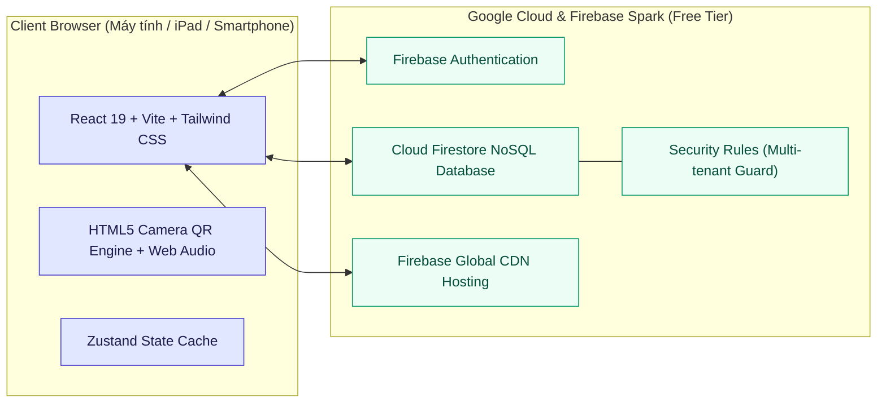

# BÁO CÁO GIẢI PHÁP & HỒ SƠ TÍNH NĂNG NỀN TẢNG QUẢN LÝ TRUNG TÂM GIÁO DỤC (QLTT)
### *Hệ Thống Quản Trị Chuỗi Trung Tâm Dạy Thêm & Bồi Dưỡng Toán Học Toàn Diện*

---

## 1. TỔNG QUAN GIẢI PHÁP (EXECUTIVE SUMMARY)

**QLTT (Quản Lý Trung Tâm)** là nền tảng chuyển đổi số toàn diện dành riêng cho các chuỗi trung tâm bồi dưỡng văn hóa, trung tâm luyện thi và trung tâm Toán học quy mô từ 1 đến nhiều cơ sở. Hệ thống được xây dựng nhằm giải quyết triệt để 5 "điểm nghẽn" kinh điển trong vận hành giáo dục ngoài giờ chính khóa:

1. **Thất thoát buổi học & Học phí:** Không kiểm soát được số buổi thực tế học sinh đã học so với gói học phí đã mua.
2. **Quá tải giờ cao điểm:** Giáo viên, quản lý mất 15–20 phút đầu giờ chỉ để dò danh sách giấy, điểm danh thủ công.
3. **Chồng chéo nhân sự chạy cơ sở:** Trợ giảng và giáo viên dạy luân phiên giữa các cơ sở dễ bị xếp trùng ca hoặc di chuyển không kịp.
4. **Tính lương & Chấm công thủ công cuối tháng:** Kế toán mất hàng ngày để đối soát bảng chấm công giấy, sổ tay trợ giảng với số buổi thực dạy.
5. **Chi phí phần mềm đắt đỏ:** Các phần mềm SaaS hiện hành thường thu phí thuê bao hàng tháng (vài triệu đến hàng chục triệu/năm) hoặc phát sinh chi phí server Cloud đắt đỏ.

> [!TIP]
> **Điểm đột phá của QLTT:** Vận hành trên kiến trúc **100% Client-Cloud Serverless** dựa trên hạ tầng Google Cloud & Firebase. **Chi phí duy trì máy chủ hàng tháng bằng 0 đồng**, dữ liệu độc lập bảo mật tuyệt đối, hoạt động mượt mà trên cả máy tính, máy tính bảng và điện thoại thông minh.

---

## 2. BẢNG SO SÁNH NĂNG LỰC: QLTT VỚI MÔ HÌNH TRUYỀN THỐNG

| Tiêu chí so sánh | Quản lý bằng Excel / Sổ sách giấy | Các phần mềm SaaS khác trên thị trường | Nền tảng QLTT (Giải pháp hiện đại) |
| :--- | :--- | :--- | :--- |
| **Chi phí máy chủ duy trì** | Miễn phí nhưng dễ mất dữ liệu | 5.000.000đ – 25.000.000đ / năm | **0 đồng trọn đời** (Tối ưu trên Google Cloud Spark) |
| **Quản lý đa cơ sở** | File phân tán, không đồng bộ thời gian thực | Tính thêm phí trên từng chi nhánh | **Tích hợp sẵn quản lý chuỗi 3–N cơ sở** |
| **Điều phối nhân sự chạy cơ sở**| Dễ xếp trùng lịch giáo viên/trợ giảng | Không có tính năng phát hiện trùng lịch | **Ma trận lịch dạy 3 cơ sở song song + Tự động báo động trùng giờ** |
| **Phương thức điểm danh** | Dò tên trên giấy, mất 15–20 phút | Nhập thủ công trên máy tính | **Quét QR Code bằng camera điện thoại 0.1s + Có âm thanh báo hiệu** |
| **Cơ chế trừ buổi học** | Cộng trừ tay, dễ nhầm lẫn gói cũ/mới | Trừ tháng cố định, thiếu linh hoạt theo gói | **Thuật toán FIFO chuẩn xác:** Gói mua trước trừ trước, vắng có phép không trừ buổi |
| **Tính lương giáo viên & Trợ giảng**| Mất 3–5 ngày tổng hợp cuối tháng | Rời rạc, không liên kết trực tiếp với dữ liệu điểm danh | **1-Click tự động tính lương theo ca dạy thực tế**, in phiếu lương có logo, gửi Zalo |
| **Tương tác Phụ huynh** | Gọi điện thoại hoặc nhắn tin SMS tốn phí | Cần cài App phụ huynh cồng kềnh | **1 chạm gửi thông báo Zalo trực tiếp**, thẻ học sinh điện tử thông minh |

---

## 3. KIẾN TRÚC & PHÂN QUYỀN HỆ THỐNG (ROLE-BASED ACCESS CONTROL)

Hệ thống được thiết kế theo chuẩn phân quyền 5 tầng bảo mật, đảm bảo dữ liệu tài chính nhạy cảm được bảo vệ tuyệt đối:

* **Chủ trung tâm (Owner):** Nắm quyền tối cao toàn hệ thống. Xem báo cáo doanh thu tài chính, dòng tiền, bảng lương, ma trận lịch dạy toàn bộ các cơ sở, xuất file chốt sổ tháng.
* **Quản lý cơ sở (Manager):** Quản lý học sinh, lớp học, bán gói buổi học, thu học phí, phê duyệt điểm danh và quản lý nhân sự tại cơ sở được phân quyền.
* **Giáo viên (Teacher):** Xem lịch dạy của các lớp mình phụ trách, xem danh sách học sinh, điểm danh, ghi chú tiến độ học tập. **Hoàn toàn bị ẩn doanh thu, học phí và bí mật kinh doanh của trung tâm.**
* **Trợ giảng (TA):** Hỗ trợ điểm danh 1 chạm bằng QR Code, điểm danh ca học bù, xem lịch trực ca. Không xem tài chính trung tâm.
* **Phụ huynh / Học sinh:** Xem thẻ học sinh QR cá nhân, tra cứu số buổi còn lại và lịch sử chuyên cần.

---

## 4. CHI TIẾT CÁC PHÂN HỆ TÍNH NĂNG ĐỈNH CAO

### 4.1. Phân hệ Ma trận Lịch Dạy & Trực Ca Toàn Hệ Thống 3 Cơ Sở
*Tính năng độc quyền giải quyết bài toán nhân sự chạy cơ sở của Chủ trung tâm.*

* **Màn hình song song 3 chi nhánh:** Hiển thị trực quan cùng lúc Cơ sở 1, Cơ sở 2, Cơ sở 3 theo từng ngày trong tuần (Thứ Hai đến Chủ Nhật) hoặc theo ngày được chọn.
* **Chi tiết từng ca học theo dòng thời gian:** Liệt kê rõ khung giờ (`17:30 - 19:00`), Phòng học, Tên lớp, Giáo viên chính và Trợ giảng phụ trách.
* **Thuật toán tự động phát hiện xung đột lịch (Conflict Detection):**
  * *Báo động trùng giờ:* Hệ thống phát hiện ngay nếu một Giáo viên hay Trợ giảng vô tình bị xếp dạy ở 2 cơ sở khác nhau trong cùng một khung giờ (`⚠️ Báo động đỏ`).
  * *Cảnh báo di chuyển gấp:* Hệ thống phát hiện nếu thời gian kết thúc ca ở Cơ sở 1 và bắt đầu ca ở Cơ sở 2 cách nhau dưới 20 phút để kịp thời điều chỉnh nhân sự (`⚡ Cảnh báo vàng`).
* **Lọc thông minh theo nhân sự:** Chọn tên bất kỳ Giáo viên hoặc Trợ giảng để xem lộ trình làm việc cả tuần của nhân sự đó qua từng cơ sở.

---

### 4.2. Phân hệ Điểm Danh 1 Chạm Thông Minh bằng Mã QR
*Tối ưu hóa quy trình đầu giờ từ 20 phút xuống còn 1 giây/học sinh.*

* **Thẻ học sinh điện tử chuẩn nhận diện:** Tự động tạo thẻ học sinh có gắn mã định danh QR Code độc bản, in trực tiếp từ hệ thống kèm logo trung tâm, họ tên, mã số học viên.
* **Quét siêu tốc bằng Camera:** Chạy trực tiếp trên trình duyệt Chrome/Safari/Edge của điện thoại iPhone, Android hoặc Webcam laptop mà **không cần cài đặt App từ kho ứng dụng**.
* **Âm thanh phản hồi trực quan (Audio Synthesizer):** Tích hợp âm báo "Ting-Ting" xác nhận điểm danh thành công qua Web Audio API, giúp trợ giảng điểm danh liên tục hàng chục học sinh mà không cần dán mắt vào màn hình.
* **Quy chuẩn trừ buổi học minh bạch (FIFO Deduction Engine):**
  * `Có mặt`: Trừ đúng 1 buổi vào gói học sinh mua trước.
  * `Học bù`: Trừ đúng 1 buổi vào gói đang kích hoạt.
  * `Vắng không phép`: Trừ 1 buổi để rèn luyện ý thức học tập.
  * `Vắng có phép`: **Không trừ buổi**, bảo lưu quyền lợi cho phụ huynh.
* **Thông báo tức thì qua Zalo:** 1 click mở ứng dụng Zalo với nội dung soạn sẵn gửi cho phụ huynh: thông báo con đã vào lớp an toàn hoặc vắng mặt, kèm số buổi học còn lại.

---

### 4.3. Phân hệ Hồ Sơ Toàn Diện 360° Của Học Sinh
*Quản lý trọn đời vòng đời học tập của từng học viên từ ngày đầu nhập học.*

* **Dữ liệu tổng quan:** Họ tên, ảnh đại diện vui nhộn theo mã số, cơ sở đang học, **ngày đầu tiên nhập học tại trung tâm**, số điện thoại phụ huynh.
* **3 chỉ số sức khỏe học tập (Health KPIs):**
  1. *Số buổi còn lại:* Cảnh báo màu đỏ nổi bật khi số buổi $\le 2$ để tư vấn viên kịp thời chăm sóc phụ huynh gia hạn gói.
  2. *Tỉ lệ chuyên cần (%):* Đánh giá mức độ đi học đầy đủ của học sinh.
  3. *Tình trạng học phí:* Báo chi tiết "Đã đóng đủ" hoặc số tiền công nợ còn lại.
* **3 Tab chuyên sâu:**
  * *Tab Gói buổi học:* Lịch sử mọi gói học sinh đã mua, số buổi đã dùng, số buổi còn lại, thanh phần trăm tiến độ trực quan.
  * *Tab Nhật ký điểm danh:* Xem chi tiết mọi ngày giờ học sinh đến lớp, lý do vắng, tên lớp, giáo viên dạy.
  * *Tab Lịch sử đóng tiền:* Chi tiết từng phiếu thu, số tiền, ngày nộp, hình thức thanh toán (tiền mặt / chuyển khoản ngân hàng).
* **Tiện ích tích hợp:** Mở thẻ QR điện tử và nhắn Zalo trực tiếp cho cha mẹ học sinh ngay trong hồ sơ.

---

### 4.4. Phân hệ Tự Động Tính Lương & Chấm Công Giáo Viên / Trợ Giảng
*Xóa bỏ hoàn toàn công việc ghi chép sổ sách và tranh cãi thù lao cuối tháng.*

* **Tự động đối soát số ca dạy:** Hệ thống quét toàn bộ dữ liệu điểm danh và buổi học thực tế diễn ra trong tháng, tự động tổng hợp số ca đứng lớp của từng Giáo viên và số ca trực của từng Trợ giảng.
* **Cơ chế thù lao linh hoạt:** Cho phép cài đặt mức lương theo ca/buổi riêng biệt cho từng thầy cô hoặc trợ giảng, thêm tiền thưởng chuyên cần, phụ cấp xăng xe trách nhiệm hoặc trừ phạt.
* **In Phiếu Lương chuẩn thương hiệu:** Xuất mẫu phiếu lương chuyên nghiệp hiển thị logo trung tâm, bảng kê chi tiết các ca dạy trong tháng, chữ ký xác nhận của Ban Giám đốc và Người nhận.
* **Thông báo lương qua Zalo:** Gửi bảng tổng kết thù lao cho giáo viên/trợ giảng qua Zalo chỉ với một cú chạm.

---

### 4.5. Phân hệ Báo Cáo Chốt Sổ Tháng & Xuất Excel Chuẩn Tiếng Việt
*Công cụ đắc lực dành cho Chủ trung tâm kiểm soát doanh số và đưa ra quyết định kinh doanh.*

* **Bộ lọc linh hoạt:** Xem báo cáo gộp toàn bộ chuỗi cơ sở hoặc xem chi tiết từng chi nhánh theo từng tháng/năm.
* **Bảng tổng kết chốt sổ từng lớp học:**
  * Tên lớp, môn học, cơ sở.
  * Giáo viên phụ trách & Trợ giảng trực ca.
  * Sĩ số học sinh thực tế đang học.
  * Số buổi đã tổ chức dạy trong tháng.
  * Tổng lượt học sinh đi học & Tỉ lệ chuyên cần (%).
  * Doanh thu bán gói mới trong tháng của lớp.
  * Công nợ học sinh còn tồn của lớp.
* **Hàng tổng kết cuối trang (Executive Footer):** Tự động tính tổng toàn hệ thống: Tổng số lớp, Tổng sĩ số, Tổng số buổi dạy, Tổng doanh thu, Tổng công nợ.
* **Xuất file Excel / CSV chuẩn UTF-8 BOM:** Tải file về máy tính Windows mở bằng Microsoft Excel hiển thị chữ Tiếng Việt có dấu chuẩn 100%, không bao giờ xảy ra lỗi font chữ (mojibake).
* **Biểu đồ xu hướng tài chính:** Biểu đồ cột trực quan theo dõi doanh thu thực thu 6 tháng gần nhất và cơ cấu nguồn thu (Tiền mặt vs Chuyển khoản).

---

## 5. THÔNG SỐ KỸ THUẬT & AN TOÀN DỮ LIỆU

* **Công nghệ Frontend:** React 19, TypeScript, Vite, Tailwind CSS, Lucide Icons, HTML5-QRCode, QRCode Generator.
* **Hạ tầng Cơ sở Dữ liệu:** Google Cloud Firestore (NoSQL Document Store phân tán toàn cầu, độ trễ $< 50$ms).
* **Bảo mật đa khách hàng (Multi-Tenant Isolation):** Mỗi trung tâm là một Organization độc lập tuyệt đối. Mọi truy vấn và bản ghi đều được khóa chặt bằng Firestore Security Rules kiểm tra quyền hạn `orgId == myOrgId()`.
* **Tiêu chuẩn vận hành 0 đồng:** Không sử dụng Cloud Functions (không bắt buộc thẻ tín dụng quốc tế, không lo bị tính phí ngoài ý muốn). Ứng dụng chạy vĩnh viễn trên gói Spark miễn phí 100% của Google.

---

## 6. LỢI ÍCH KINH TẾ DÀNH CHO KHÁCH HÀNG

1. **Tiết kiệm ít nhất 15.000.000đ – 30.000.000đ/năm** chi phí thuê bao phần mềm và chi phí máy chủ Cloud.
2. **Tiết kiệm 80% thời gian** điểm danh đầu giờ của giáo viên và trợ giảng.
3. **Cắt giảm 100% tình trạng thất thoát học phí:** Hệ thống kiểm soát chính xác từng buổi học, phụ huynh không thể học "lố" số buổi đã nộp tiền.
4. **Tăng tỉ lệ gia hạn gói học thêm 35%:** Nhờ tính năng cảnh báo sớm số buổi học $\le 2$, trung tâm chủ động nhắc phí trước khi học sinh hết buổi.
5. **Nâng tầm hình ảnh chuyên nghiệp:** Thẻ học sinh gắn mã QR, điểm danh kêu ting-ting hiện đại, phiếu lương in logo sắc nét tạo dựng niềm tin tuyệt đối với phụ huynh và thầy cô.

---

## 7. LỘ TRÌNH TRIỂN KHAI NHANH TRONG 24 GIỜ

* **Bước 1 (1 giờ):** Khởi tạo tài khoản trung tâm, thiết lập danh mục 3 cơ sở và tải lên Logo thương hiệu.
* **Bước 2 (2 giờ):** Nhập danh sách học sinh hàng loạt bằng công cụ Copy/Paste từ Excel (chỉ mất 1 cú bấm).
* **Bước 3 (1 giờ):** Tạo danh sách lớp học, phân công giáo viên/trợ giảng và cài đặt khung giờ tuần.
* **Bước 4 (2 giờ):** In hàng loạt thẻ học sinh có mã QR và hướng dẫn trợ giảng quét camera trên điện thoại.
* **Bước 5:** Bắt đầu vận hành chính thức, theo dõi trực tiếp trên Dashboard của Ban Giám đốc!

---
*(Tài liệu giải pháp phần mềm được biên soạn bởi Ban Kỹ Thuật Dự Án QLTT — Đồng hành cùng sự phát triển của các Trung tâm Giáo dục Việt Nam)*
